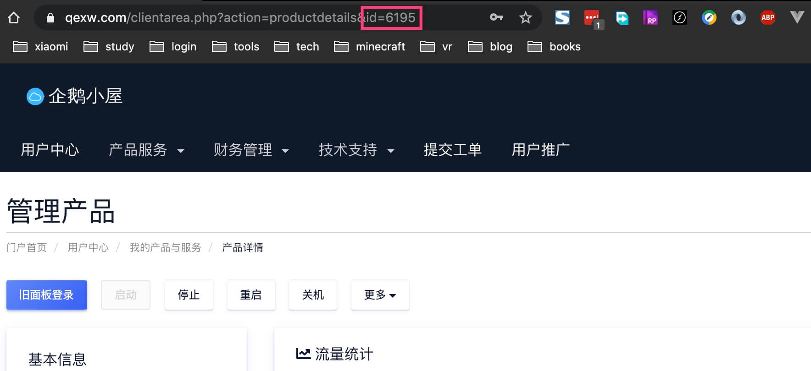

# qexw-cli

[](https://www.npmjs.com/package/qexw-cli)

[](https://github.com/vincent0700/qexw-cli/blob/master/LICENSE)
[](https://www.npmjs.com/package/qexw-cli)
[](https://www.npmjs.com/package/qexw-cli)

企鹅小屋 VPS 脚本


## 安装

```bash
$ npm install -g qexw-cli
```

Or

```
$ yarn global add qexw-cli
```

## 用法

```
$ qexw -h
Usage: qexw [options] [command]

A Commandline tool for https://www.qexw.com

Options:
  -V, --version  output the version number
  -h, --help     output usage information

Commands:
  login          Sign in with your account
  detail <id>    Get product detail
```

## 示例

### 登陆账户

```
$ qexw login
[QEXW] Please Input your email & password
? Email: wang.yuanqiu007@gmail.com
? Password: [hidden]
[QEXW] Page to https://www.qexw.com/dologin.php
[QEXW] Welcome, Vincent
```

### 获取详情

你可以在产品管理页获取产品 ID



---

```
$ qexw detail 6195

# Basic Info
┌───────────┬─────────────────────────┬───────────┬─────────────────────────┐
│ uuid      │ cphdioz5qldsooa0        │ hostname  │ hongkong-cn2            │
├───────────┼─────────────────────────┼───────────┼─────────────────────────┤
│ ips       │ 175.115.203.114         │ status    │ online                  │
├───────────┼─────────────────────────┼───────────┼─────────────────────────┤
│ os        │ ubuntu-18.04-x86_64     │ virt      │ kvm                     │
├───────────┼─────────────────────────┼───────────┼─────────────────────────┤
│ cores     │ 1                       │ ram       │ 1.0 G                   │
├───────────┼─────────────────────────┼───────────┼─────────────────────────┤
│ space     │ 20 G                    │ netspeed  │ 20 Mbps                 │
└───────────┴─────────────────────────┴───────────┴─────────────────────────┘

# Usage Info
┌───────────┬───────────────┬─────────┬───────────┬───────────────┬─────────┐
│ cpu       │ 0.1G / 1.8G   │ 6.4%    │ ram       │ 0.0G / 1.0G   │ 0%      │
├───────────┼───────────────┼─────────┼───────────┼───────────────┼─────────┤
│ disk      │ 2.8G / 20G    │ 14.39%  │ bandwidth │ 0.0T / 0.5T   │ 1.56%   │
└───────────┴───────────────┴─────────┴───────────┴───────────────┴─────────┘

# Payment Info
┌───────────┬─────────────────────────┬───────────┬─────────────────────────┐
│ next_due  │ 2020-03-13              │ remaining │ 26 days                 │
└───────────┴─────────────────────────┴───────────┴─────────────────────────┘
```
